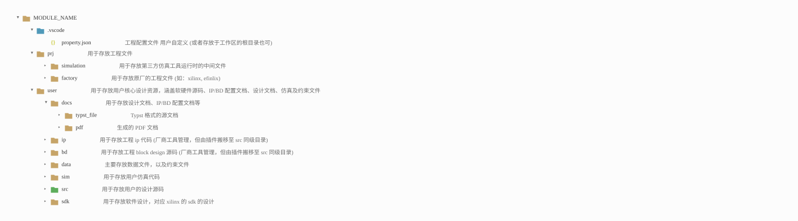

# Introduction

OpenHDL-Core is an open, modular, and extensible hardware design core library.

It aims to provide a unified and reusable foundation for digital hardware development, covering a wide spectrum of hardware building blocks across different abstraction levels and design domains. Rather than focusing on a specific category of components, the project is intended to serve as a long-term, evolving foundation for diverse hardware systems.

The project is not limited to a particular hardware description language, implementation style, or fixed set of modules. As new components, architectures, and design methodologies emerge, OpenHDL-Core is designed to grow and adapt accordingly.

Emphasizing modularity, clarity, and long-term maintainability, OpenHDL-Core is designed to support scalable and sustainable hardware system development.

# Project Philosophy

OpenHDL-Core is built around a set of design principles that prioritize long-term usability, clarity, and evolution over short-term completeness.

## Modularity First

All designs are structured as independent and self-contained modules with well-defined interfaces. Each module should be reusable in different contexts without relying on implicit assumptions about the surrounding system.

## Clarity over Cleverness

Readability and explicitness are preferred over overly compact or obscure implementations. The code should be easy to understand, review, and maintain, even by developers who are not the original authors.

## Reusability as a Core Goal

Modules are designed to serve as general-purpose building blocks rather than project-specific solutions. Flexibility and composability are favored over narrow, highly specialized implementations.

## Language and Methodology Agnostic

The project does not enforce a single hardware description language or design methodology. Any language or approach suitable for digital hardware design is acceptable, as long as it adheres to the overall project philosophy.

## Evolution-Oriented Design

OpenHDL-Core is expected to grow and evolve over time. Architectural consistency and clean abstractions are valued more than having a complete feature set at any given moment.

# Project Structure

To ensure consistency and support the "Modularity First" philosophy, every module within OpenHDL-Core adheres to a standardized directory layout.

This structure strictly separates portable user design assets (`user/`) from vendor-specific engineering files (`prj/`), ensuring that the core design remains reusable and tool-agnostic.

## Repository Contents

To maintain a clean and lightweight codebase, only the essential source files are committed to the repository. The version control system tracks only:

*   **src**: RTL source code.
*   **sim**: User simulation code and testbenches.
*   **data**: Constraint files (e.g., .xdc, .sdc).
*   **docs**: Design documentation (detailed below).

All other directories (such as `prj`, `ip`, `bd`, `.vscode`) are considered local workspace artifacts or generated files and are excluded.

## Documentation Details

The `docs` directory is the knowledge base for each module. It is divided into three categories to serve different purposes and audiences.

### 1. Specification (`ModuleName_spec`)
**Target Audience:** Users and Integrators.
This document describes *what* the module does and how to use it. It covers:
*   **Overview**: Functional summary and performance metrics.
*   **Interface**: Signal lists, timing diagrams, and protocol definitions.
*   **Micro-Architecture**:
    *   Block Diagrams & Sub-module partitioning.
    *   Key FSM descriptions and state diagrams.
    *   Data flow paths.
*   **Register Map**: Address offsets, bit widths, and access permissions (RW/RO).
*   **Clock & Reset**: Clock domain crossing and reset strategies.
*   **Simulation Guide**: Instructions on how to run the provided testbenches.

### 2. Implementation Guide (`ModuleName_impl_guides`)
**Target Audience:** Developers and Maintainers.
This document describes *how* the module is implemented internally. It covers:
*   **Design Rationale**: The thought process behind the design and algorithm derivations.
*   **Internal Logic**: Detailed implementation specifics and coding style explanations.
*   **FSM Details**: Logic for state transitions.
*   **Parameter Selection**: Rationale for key parameters (e.g., why a specific FIFO depth was chosen).
*   **Timing Optimization**: Analysis of critical paths and optimization techniques used.

### 3. IP/BD Configuration
**Target Audience:** Implementation Engineers.
*   Contains configuration files or settings for Block Designs (BD) or Vendor IPs used in the project, ensuring the design environment can be reproduced.

---

> **Note on Documentation Availability:**
> *   **Specification**: Mandatory for **ALL** modules.
> *   **Implementation Guide**: Provided only for complex modules. Simple utility modules may skip this if the code is self-explanatory.
> *   **IP/BD Configuration**: Provided only for modules that utilize specific Vendor IPs or Block Designs.

